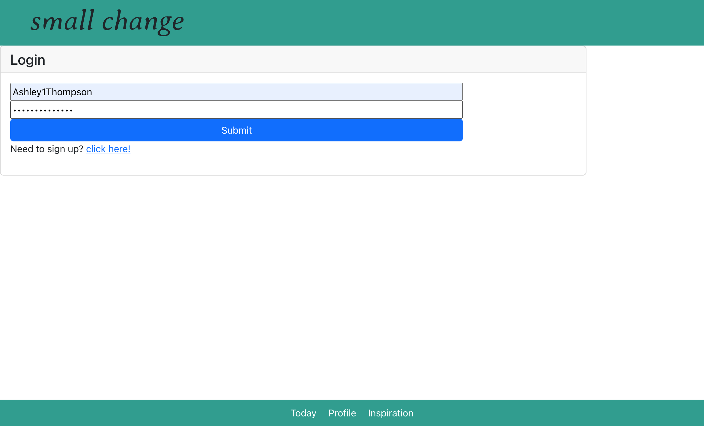
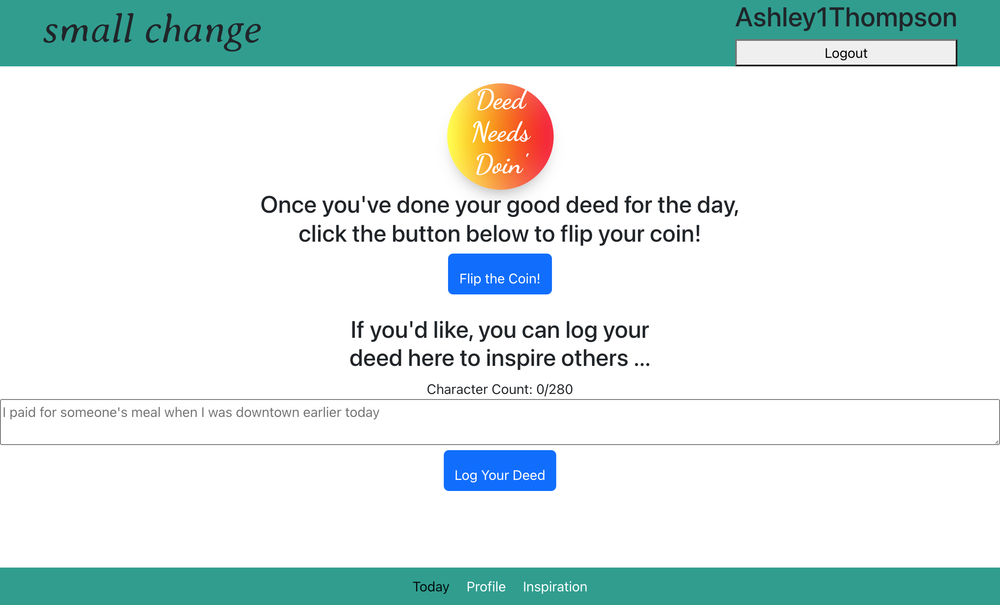
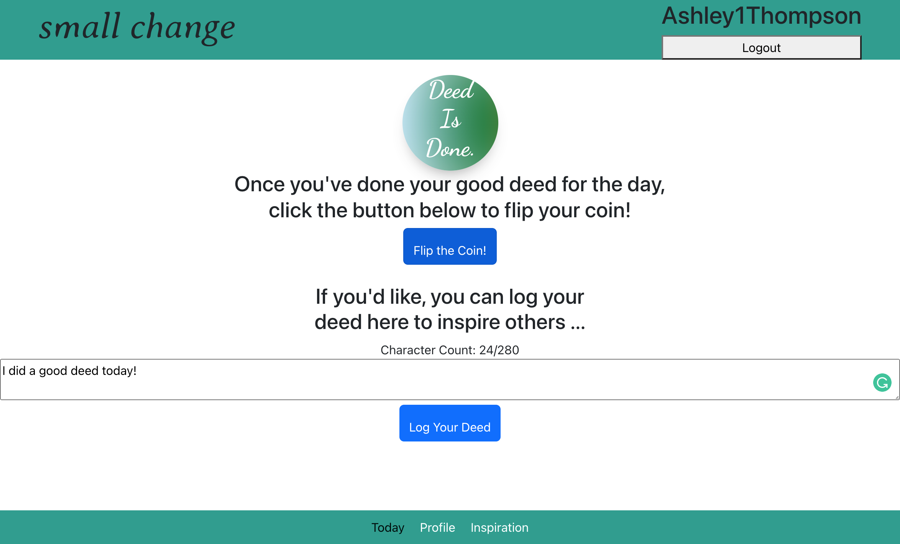
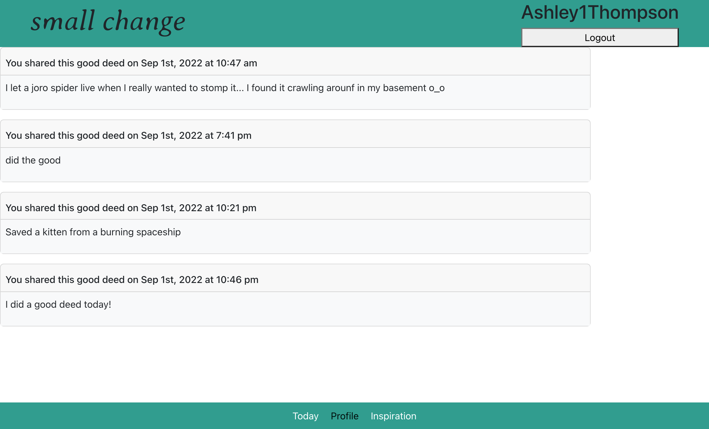
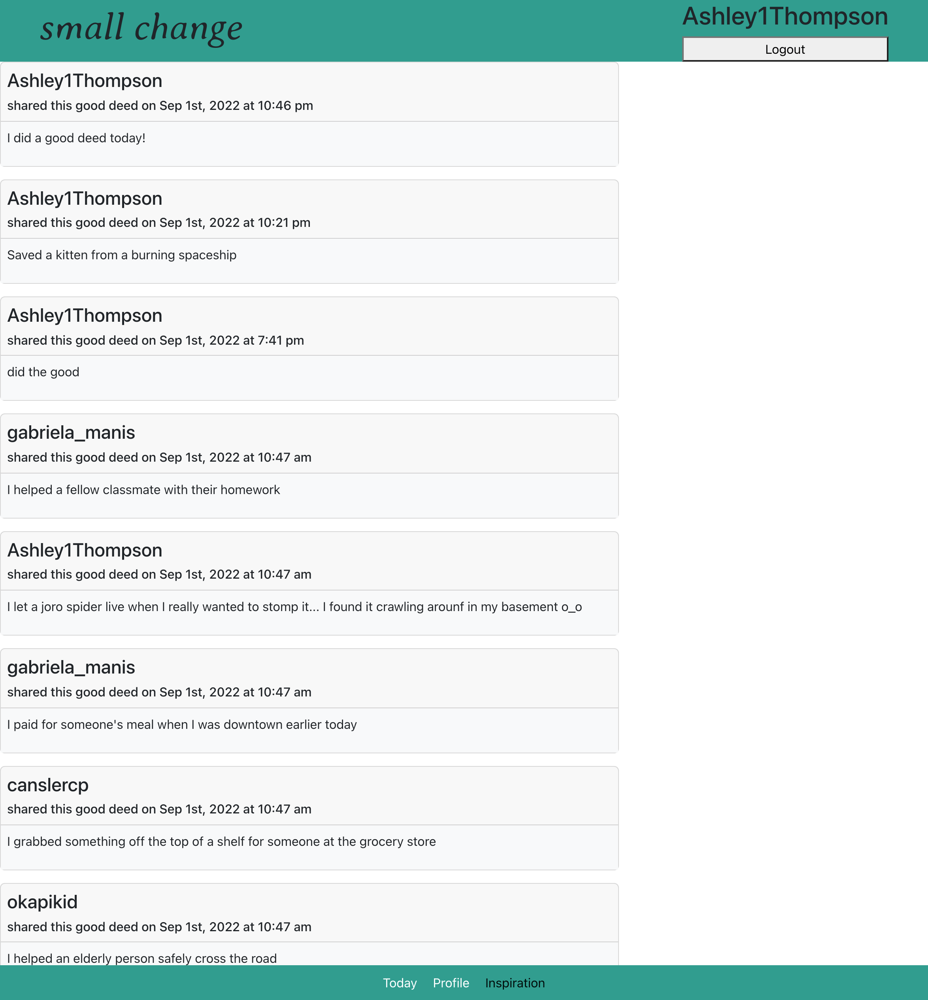

# Small Change
## It feels good to do good

    

Small Change is an app to encourage and inspire people to bring more kindness into their day-to-day routine. It utilizes the MERN stack and GraphQL.

## Table of Contents
1. [Features](#Features)
2. [Functionality](#Functionality)
3. [Tech](#Tech)
4. [Installation](#Installation)
5. [License](#License)
6. [Contributors](#Contributors)
7. [Contact](#Contact)

## Features

- Login or Sign up functionality creates a user profile where you can keep track of your Good Deeds.
- Flip your coin to mark your Good Deed.
- Ispire others by logging your Good Deed, which will be displayed publicly on the Inspirations page.

Future development will inlcude a nastive mobile app, customizable coins, and interactions on the Inspirations page.

## Functionality
The following screenshots demonstrate the app's functionality

Login In or Sign Up

Coin Flip - No Deed Yet

Coin Flip - Deed Complete!

User Profile Page

Inspirations Page

## Tech
          

## Installation

1. Clone the repo to your local machine. 
2. Install the dependencies in the package.json.
3. $ npm run deploy  ||  $ npm run develop
4. App will open on your localhost.

## License

MIT

## Contributors
Corbin Cansler
Mike Augustine
Ashley Thompson

## Contact
##### Contact the creators of this app on Github!

Corbin Cansler  
https://github.com/canslercp  

Mike Augustine  
https://github.com/Okapikid  

Ashley Thompson  
https://github.com/Ashley1Thompson
